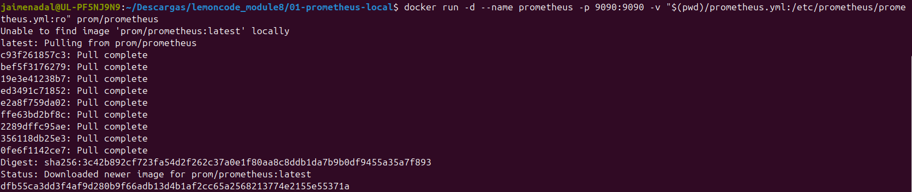
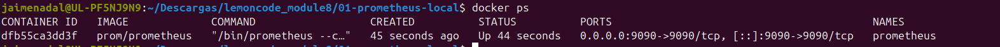
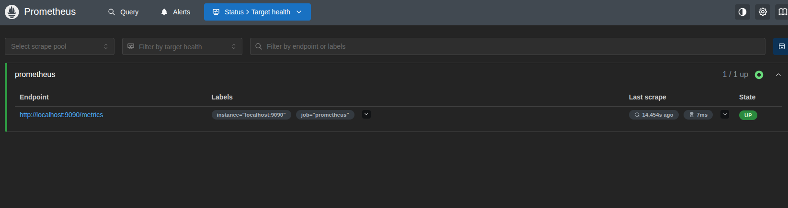
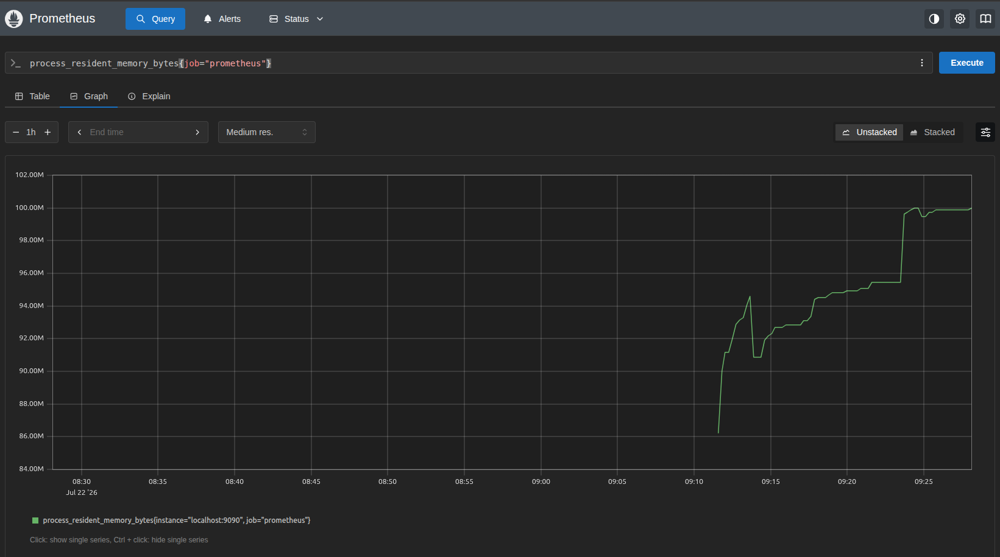
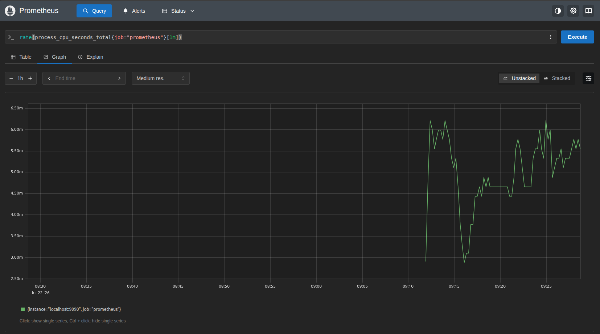

# Ejercicio 1 — Prometheus en local con Docker

## Arranque

Desde este directorio:

```bash
docker run -d \
  --name prometheus \
  -p 9090:9090 \
  -v "$(pwd)/prometheus.yml:/etc/prometheus/prometheus.yml:ro" \
  prom/prometheus
```

El puerto por defecto del cliente web es el `9090`, mapeado 1:1 al host. La interfaz queda en `http://localhost:9090`.





Verificación de que el auto-scraping funciona: en **Status → Target health** el endpoint `http://localhost:9090/metrics` debe aparecer en estado `UP`. Alternativa rápida desde la propia consola de queries: la expresión `up` debe devolver `up{instance="localhost:9090", job="prometheus"} = 1`.



## Query sobre memoria utilizada

```promql
process_resident_memory_bytes{job="prometheus"}
```

Devuelve la memoria residente (RSS) del propio proceso de Prometheus en bytes. Una variante más específica del runtime de Go:

```promql
go_memstats_heap_inuse_bytes{job="prometheus"}
```



## Query sobre CPU utilizada

```promql
rate(process_cpu_seconds_total{job="prometheus"}[1m])
```

`process_cpu_seconds_total` es un counter (segundos de CPU acumulados desde el arranque), así que en crudo solo crece. `rate(...[1m])` lo convierte en consumo medio de CPU por segundo durante el último minuto — un valor de `0.02` significa un 2% de un core.



## Limpieza

```bash
docker rm -f prometheus
```
