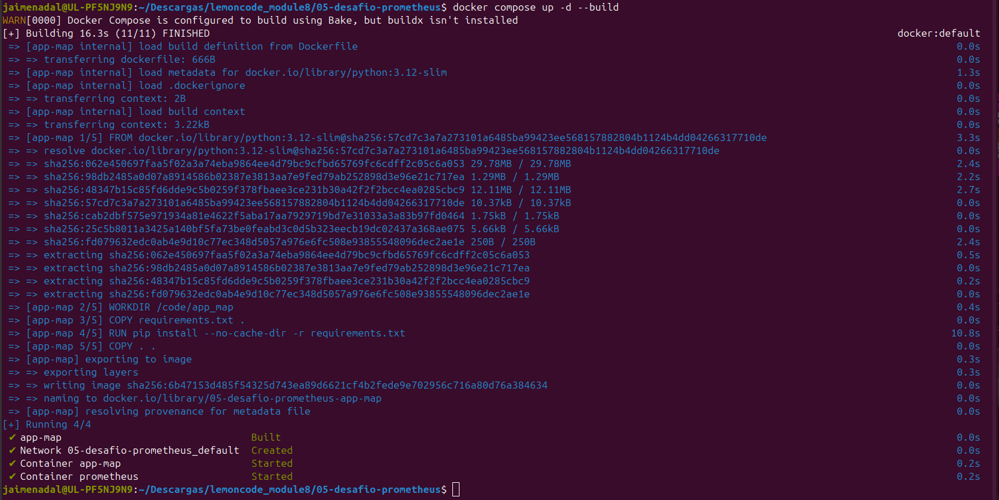
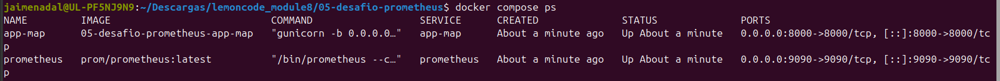
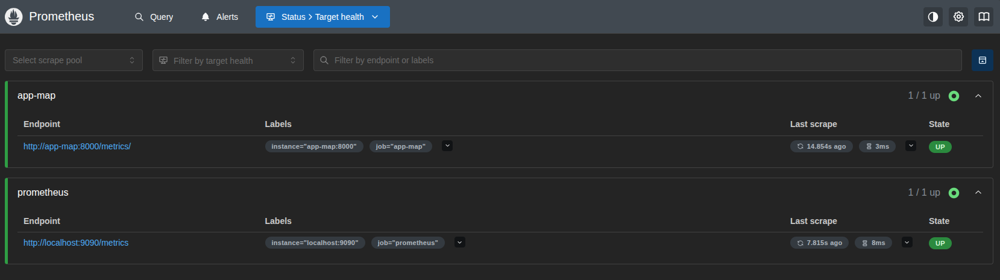
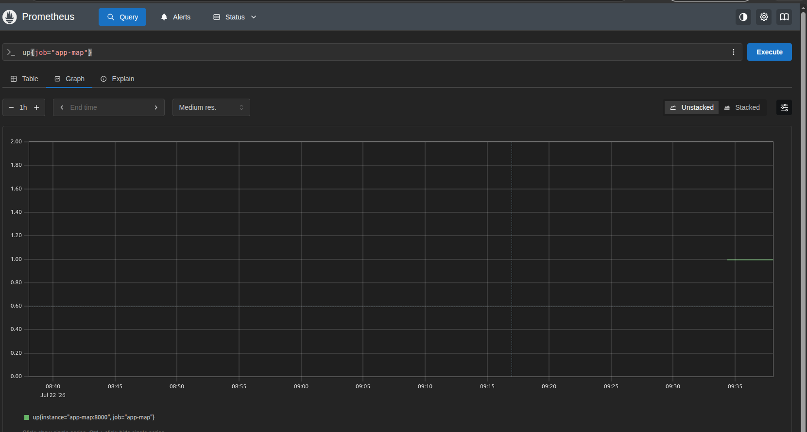
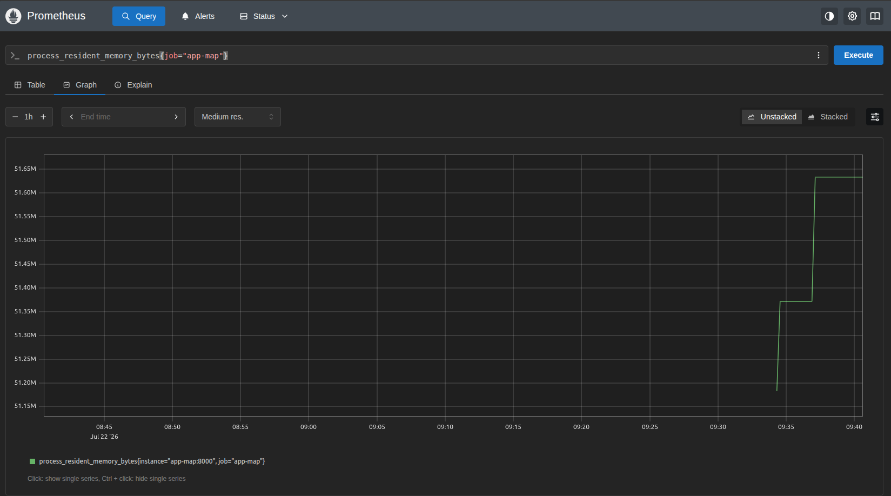
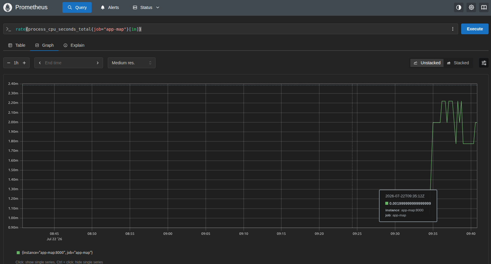
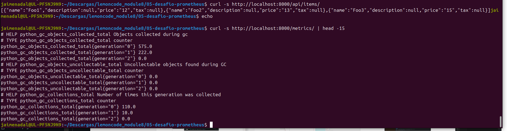

# Desafío 5.1 — Docker Compose: app_map + Prometheus

## Qué se ha hecho

1. **App**: se ha copiado `app_map` del repo [JaimeSalas/non-political-map](https://github.com/JaimeSalas/non-political-map) y se ha instrumentado siguiendo la doc oficial de client_python ([FastAPI + Gunicorn](https://prometheus.github.io/client_python/exporting/http/fastapi-gunicorn/)): `make_asgi_app()` montado en `/metrics` dentro de `main.py`, y `prometheus-client` + `gunicorn` añadidos a `requirements.txt`. Con eso se exponen las métricas por defecto del cliente Python (proceso, GC, `python_info`).
2. **Dockerfile** para la app: imagen `python:3.12-slim`, Gunicorn con worker Uvicorn en el puerto 8000, tal cual indica la doc.
3. **Servicio Prometheus** con el target `app-map:8000` (resolución por nombre de servicio dentro de la red del compose).

## Dos trampas encontradas (y resueltas)

**Orden de los mounts en `main.py`.** La app original monta los estáticos en `/` (`app.mount('/', StaticFiles(...))`). En Starlette las rutas se resuelven en orden de registro, así que el mount de `/metrics` tiene que declararse **antes** del de `/`; de lo contrario el catch-all de estáticos se traga todas las peticiones.

**Barra final en el path de métricas.** Aun con el orden correcto, `GET /metrics` (sin barra) devuelve 404: al no coincidir exactamente con el mount, la petición cae en el mount de estáticos de `/`, que no tiene ningún fichero `metrics`. `GET /metrics/` sí resuelve el sub-app de prometheus_client (verificado con `curl` sobre la app corriendo con Gunicorn). Por eso el `prometheus.yml` define `metrics_path: /metrics/` en el job `app-map`.

## Arranque

```bash
docker compose up -d --build
```





## Verificación del target

1. **UI**: `http://localhost:9090` → **Status → Target health**. El job `app-map` (`http://app-map:8000/metrics/`) debe estar `UP`, igual que el job `prometheus`.

   

2. **PromQL**: la query `up` debe devolver `1` para ambos jobs:

   ```promql
   up{job="app-map"}
   ```

   

3. **Métricas de la app llegando a Prometheus**: por ejemplo

   ```promql
   process_resident_memory_bytes{job="app-map"}
   rate(process_cpu_seconds_total{job="app-map"}[1m])
   python_gc_collections_total{job="app-map"}
   ```

   

   

4. **Directo contra la app** (sin pasar por Prometheus):

   ```bash
   curl -s http://localhost:8000/metrics/ | head
   curl -s http://localhost:8000/api/items/
   ```

   

## Limpieza

```bash
docker compose down
```

## Nota sobre el worker de Gunicorn

La doc oficial usa `-k uvicorn.workers.UvicornWorker`. En versiones recientes de uvicorn esa clase está marcada como deprecated (se movió al paquete `uvicorn-worker`), pero sigue existiendo y funcionando — verificado con uvicorn 0.51. Si en el futuro el arranque falla con `ModuleNotFoundError: uvicorn.workers`, la solución es `pip install uvicorn-worker` y cambiar el flag a `-k uvicorn_worker.UvicornWorker`.
