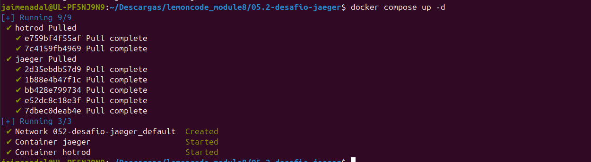
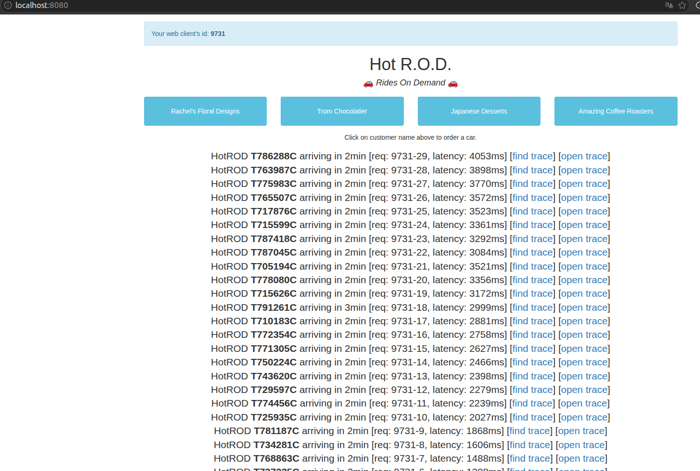
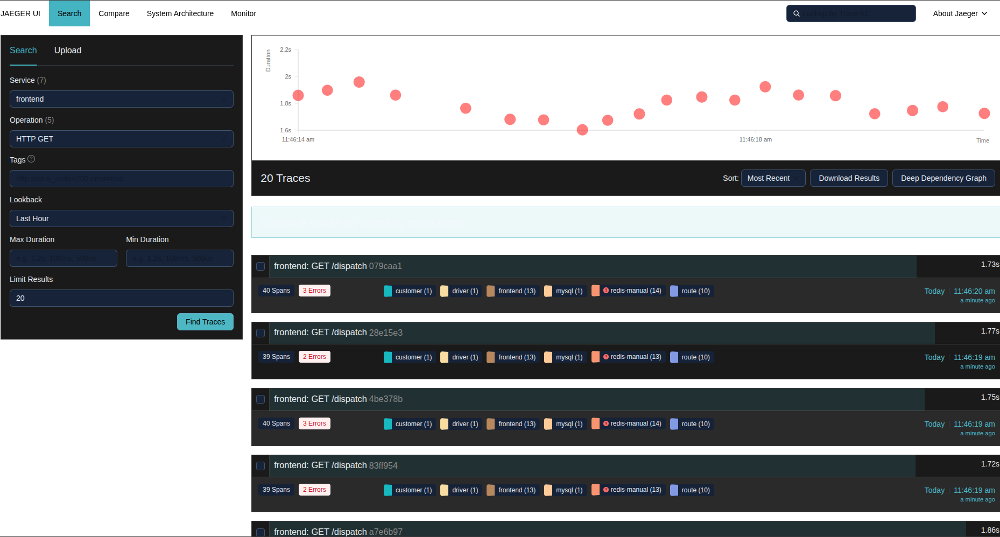
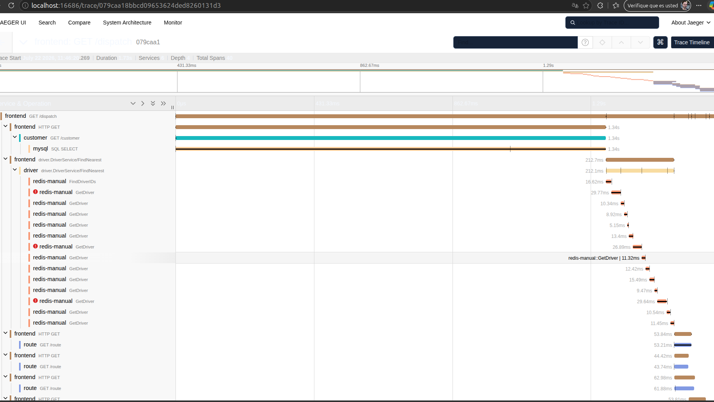
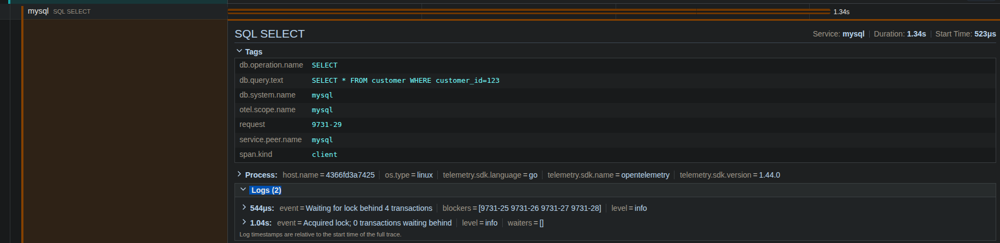
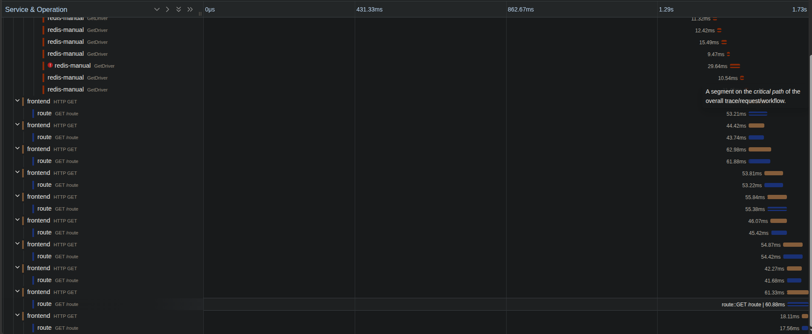
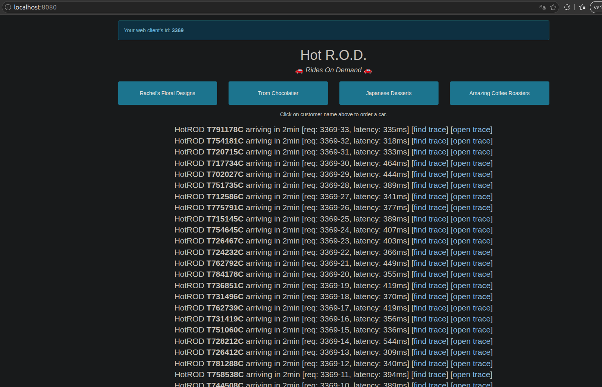
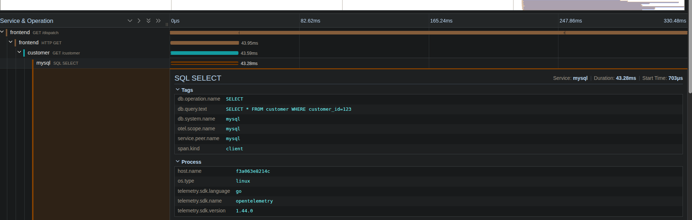

# Desafío 5.2 — Jaeger con HotROD (notas de la experiencia)

## Contexto: el tutorial está desactualizado

El [tutorial de Medium](https://medium.com/opentracing/take-opentracing-for-a-hotrod-ride-f6e3141f7941) (Yuri Shkuro, 2017) sigue siendo válido en lo conceptual — la demo HotROD y sus cuellos de botella son los mismos — pero sus comandos ya no: usa binarios descargados a mano y la instrumentación era OpenTracing con el agente de Jaeger escuchando en UDP 6831. HotROD actual está instrumentado con **OpenTelemetry** y exporta por **OTLP** (HTTP 4318). El `docker-compose.yml` de esta carpeta replica el setup del tutorial con las imágenes actuales:

```bash
docker compose up -d
```



- UI de HotROD: `http://localhost:8080`
- UI de Jaeger: `http://localhost:16686`

## Los pasos que seguí

1. **Generar tráfico.** En la UI de HotROD, pulsé uno de los botones de cliente. Cada clic simula pedir un coche: la app devuelve el conductor asignado y el ETA. Para que los problemas salieran a la luz hay que pulsar varios botones seguidos y rápido.

   

2. **Ver la traza.** En Jaeger UI busqué el servicio `frontend`, operación `HTTP GET /dispatch`, y abrí una traza. El diagrama de Gantt muestra la cascada completa: `frontend → customer → driver → route`.

   

   

3. **Issue 1 — la cola en la base de datos.** El span `mysql SQL SELECT` (dentro de customer) se disparaba de tamaño. La causa estaba en sus **logs**: líneas del tipo "esperando el lock detrás de N transacciones". La base de datos simula tener una única conexión, así que con varias peticiones a la vez las consultas se ponen en fila. En el peor caso el `SQL SELECT` llegó a **1,34 s**, cuando en condiciones normales debería tardar ~300 ms.

   

4. **Issue 2 — el pool de rutas.** Bajando al bloque de llamadas al servicio de rutas, las barras no arrancan todas a la vez: van **de tres en tres**. En cuanto una termina, entra la siguiente, formando "escalones" en el Gantt. El servicio tiene un pool de solo 3 trabajadores, así que nunca hay más de 3 cálculos de ruta en marcha simultáneamente.

   

5. **Aplicar los fixes.** HotROD expone flags para simular las correcciones; se añaden en `command` del servicio `hotrod` en el compose:

   ```yaml
   command: ["all", "--fix-db-query-delay=100ms", "--fix-disable-db-conn-mutex", "--fix-route-worker-pool-size=100"]
   ```

   `--fix-disable-db-conn-mutex` quita el lock de la base de datos (el `SQL SELECT` deja de encolarse). `--fix-route-worker-pool-size=100` agranda el pool para que las rutas se calculen en paralelo y desaparezcan los escalones. Después de recrear el contenedor (`docker compose up -d --force-recreate hotrod`) y repetir la carga, la petición se resuelve mucho más rápido.

## Notas de mi experiencia

**Setup.** Levanté el stack con `docker compose up -d` y las dos interfaces respondieron: HotROD en el 8080 y Jaeger en el 16686. <!-- CONFIRMA TÚ: ¿arrancó a la primera o tuviste algún puerto ocupado? El candidato típico es el 8080. Si te pasó, la solución fue cambiar el mapeo a 8090:8080 en el compose. Si no, borra esta frase. -->

**Primera traza.** Un `/dispatch` genera **40 spans** y toca 6 servicios. Sin apenas carga se resuelve en unos cientos de milisegundos, pero pulsando 5-10 botones seguidos y rápido se disparó a **1,73 s**. Ese salto no es más trabajo: es que las peticiones empiezan a estorbarse entre ellas.

**Diagnóstico del lock de la BD.** Me lo revelaron los **logs del span `mysql SQL SELECT`** ("esperando el lock detrás de N transacciones"). La consulta no tardaba por lenta, sino porque estaba haciendo cola. En el peor caso, casi **1 segundo entero** de esos 1,34 s era tiempo esperando en la fila, sin hacer nada.

**Diagnóstico del worker pool.** El patrón se ve claramente en el Gantt: las llamadas a rutas arrancan de tres en tres. Con 10 conductores, cuatro tandas (3+3+3+1).

**Después de los fixes.** La petición pasó de **1,73 s a 330 ms**. El flag que más notó fue el que **quita el lock de la base de datos**: por sí solo recortó el `SQL SELECT` de 1,34 s a 43 ms, la mayor parte de la mejora. El del pool de rutas ayudó, pero su impacto en el total fue menor. No todos los cuellos de botella pesan igual.





**Reflexión.** Sin tracing esto habría sido difícil de diagnosticar. Una métrica me diría "dispatch tarda 1,7 s" y ahí me quedo; no me dice que el problema es una cola en la base de datos que solo aparece con concurrencia, ni que las rutas van de tres en tres por un pool pequeño. Con logs sueltos podría intuir algo, pero reconstruir a mano el orden de 40 operaciones repartidas entre 6 servicios es inviable. El tracing da esa foto completa de un vistazo: no solo *que* algo va lento, sino *dónde* y *por qué*.

## Limpieza

```bash
docker compose down
```
